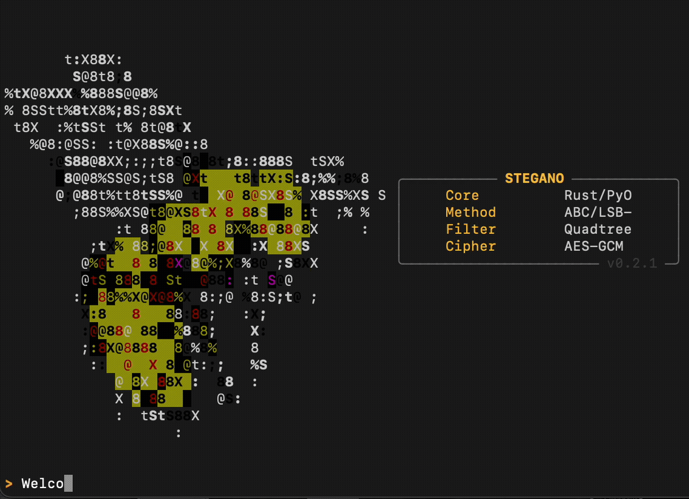
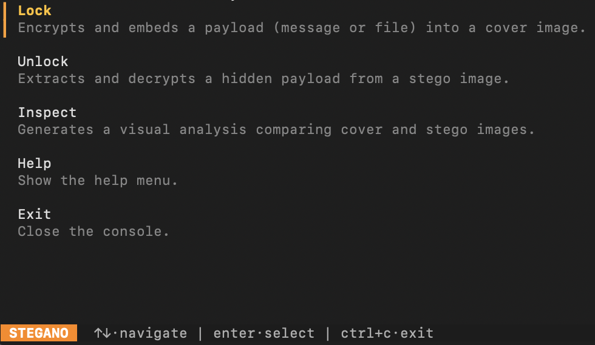
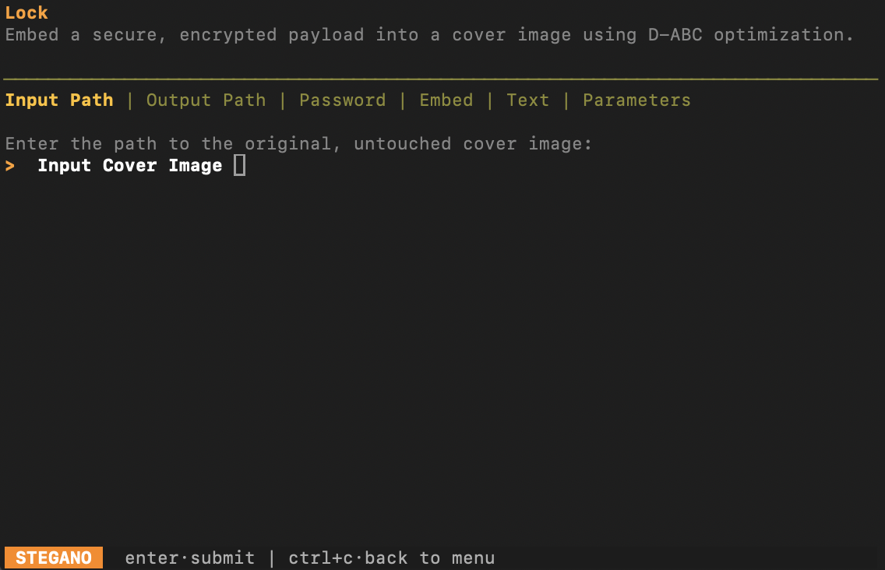
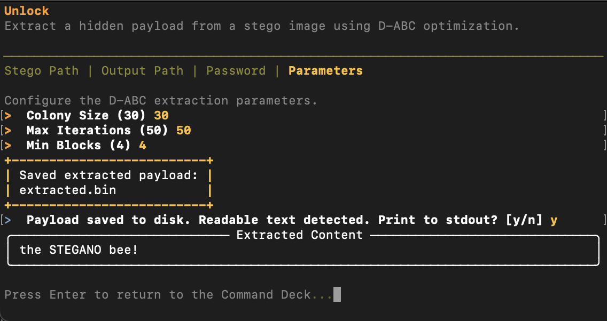
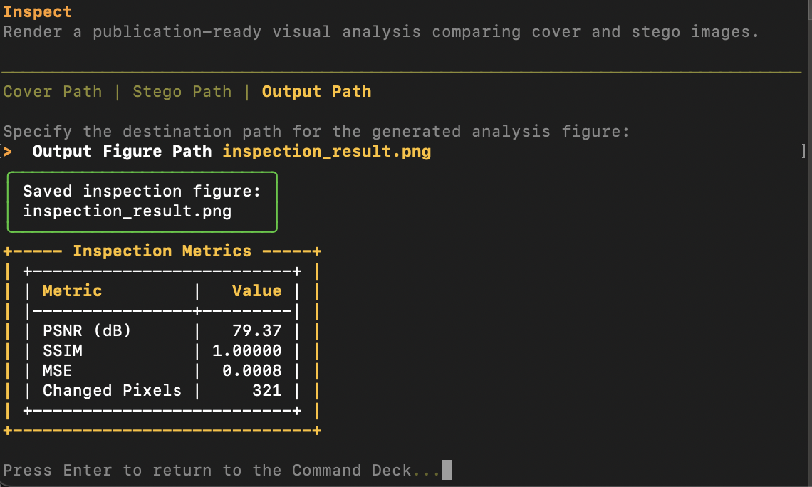
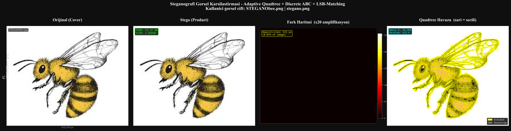
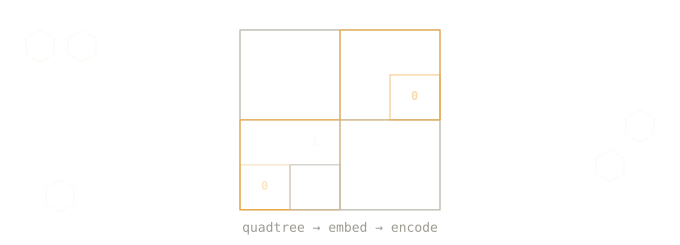
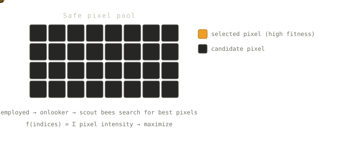

<p align="center">
  
</p>

<h1 align="center">Gizli İletişim için Yüksek Kapasiteli Steganografik Gömme</h1>

<h2 align="center"><em>Gizle. Maskele. Kalıcı kıl. Sinyali gürültü içinde sakla.</em></h2>

<p align="center">
  Algılanamaz, yüksek kaliteli veri gömme için tasarlanmış üretim kalitesinde steganografi motoru. Uyarlanabilir uzamsal ayrışım, metasezgisel piksel seçimi ve kriptografik yük korumasını bir araya getirir. İstihbarat operasyonları, güvenli iletişim ve akademik kriptanaliz için geliştirilmiştir.
</p>

<div align="center">

[](https://github.com/Berkaybbayramoglu/STEGANO)
[](https://www.python.org/)
[](https://www.rust-lang.org/)
[](LICENSE)
[](https://pypi.org/project/stegano-core/)
[](https://github.com/Berkaybbayramoglu/STEGANO/releases)
[](README.md)

</div>

---

## Kurulum

**macOS / Linux:**
```bash
pipx install stegano-core
pipx ensurepath
```

**Windows (WSL2 üzerinden):**
```bash
wsl2
pipx install stegano-core
pipx ensurepath
```

**Minimum Gereksinimler:**
- Python 3.10 veya üzeri
- 200 MB kullanılabilir RAM
- Desteklenen görüntü formatı (PNG, BMP, TIFF, PGM, JPG)

---

## Etkileşimli Demo

<p align="center">
  
</p>

STEGANO, menü tabanlı bir terminal arayüzü olarak çalışır. Araç, gerçek zamanlı doğrulama, ilerleme göstergesi ve görsel tanılamalarla kullanıcıyı adım adım yönlendirir.

```bash
stegano
```

---

## Kullanım Akışları

### Komut Merkezi

<p align="center">
  
</p>

`stegano` çalıştırıldığında Komut Merkezi açılır — klavye ile gezinilen dört işlem içeren bir menü:

- **Lock (Kilitle)** — Yükü şifreleyip bir örtü görüntüsüne göm
- **Unlock (Aç)** — Stego görüntüsünden gizli yükü çıkar ve şifresini çöz
- **Inspect (İncele)** — Örtü ve stego görüntülerinin yayına hazır karşılaştırmasını oluştur
- **Help / Exit** — Yardım ve iletişim / Programdan çıkış

---

### Lock — Yük Gömme

<p align="center">
  
</p>

**Lock** akışı her adımda satır içi doğrulama ile sizi yönlendirir:

1. **Örtü Görüntüsü** — Orijinal, dokunulmamış örtü görüntüsünün yolu (PNG önerilir)
2. **Çıktı Yolu** — Stego görüntüsünün kaydedileceği konum
3. **Parola** — PBKDF2 ile 256-bit AES anahtarı türetilir (100.000 iterasyon)
4. **Yük Türü** — Metni doğrudan yapıştır veya ikili dosya için yol gir
5. **Parametreler** — Koloni boyutu, maksimum iterasyon, minimum blok boyutu (varsayılanlar çoğu durum için uygundur)

Gömme işlemi tamamlandığında konsola uzamsal kalite metrikleri (PSNR, SSIM, MSE) yazdırılır.

---

### Unlock — Yük Çıkarma

<p align="center">
  
</p>

**Unlock** akışı, Lock'un tersini izler:

1. **Stego Yolu** — Gömülü yükü içeren görüntünün yolu
2. **Çıktı Yolu** — Çıkarılan yükün yazılacağı konum
3. **Parola** — Gömme sırasında kullanılan parola ile aynı olmalıdır
4. **Parametreler** — Gömme sırasında kullanılan koloni / iterasyon ayarlarını tekrarla

Başarı durumunda okunabilir metin içeriği isteğe bağlı olarak stdout'a yazdırılır ve ham yük diske kaydedilir. Herhangi bir veri döndürülmeden önce GCM kimlik doğrulama etiketi kontrol edilir — bozulmuş veya kurcalanmış görüntü reddedilir.

---

### Inspect — Görsel Steganaliz

<p align="center">
  
</p>

**Inspect** işlemi bir örtü / stego çifti alır ve yayına hazır PNG figürü oluşturur. Raporlanan metrikler:

| Metrik | Açıklama |
|--------|----------|
| PSNR (dB) | Tepe Sinyal-Gürültü Oranı — yüksek değer daha algılanamaz demektir |
| SSIM | Yapısal Benzerlik İndeksi — 1,0 = algısal olarak özdeş |
| MSE | Ortalama Kare Hata — piksel düzeyinde bozulma |
| Değişen Piksel | Değiştirilen piksel sayısı |

<p align="center">
  
</p>

Oluşturulan figür dört paneli yan yana gösterir: orijinal örtü, stego ürün, ×20 kuvvetlendirilmiş fark haritası ve Quadtree piksel havuzu (sarı = seçilen güvenli pikseller). Bu düzen akademik makalelere veya güvenlik raporlarına doğrudan eklenmeye uygundur.

---

## Komut Satırı Modu

Betiklenmiş veya etkileşimsiz işlemler için `stegano-product` komutunu doğrudan kullanın.

**Lock — metin mesajı göm:**
```bash
stegano-product lock -i ortu.png -o stego.png -p "parola" -m "gizli mesaj"
```

**Lock — ikili dosya göm:**
```bash
stegano-product lock -i ortu.png -o stego.png -p "parola" -f yol/dosya.bin
```

**Unlock — yükü çıkar:**
```bash
stegano-product unlock -i stego.png -o extracted.bin -p "parola"
```

**Unlock — çıkar ve metni stdout'a yazdır:**
```bash
stegano-product unlock -i stego.png -o extracted.bin -p "parola" --print
```

**Inspect — görsel rapor oluştur:**
```bash
stegano-product inspect --cover ortu.png --stego stego.png --output rapor.png
```

### Tam Flag Referansı

| Komut | Flag | Açıklama | Varsayılan |
|-------|------|----------|-----------|
| `lock` | `-i` / `--input` | Örtü görüntüsü yolu | zorunlu |
| `lock` | `-o` / `--output` | Çıktı stego görüntüsü yolu | zorunlu |
| `lock` | `-p` / `--password` | AES-GCM şifreleme parolası | zorunlu |
| `lock` | `-m` / `--message` | Gömülecek metin yükü | — |
| `lock` | `-f` / `--file` | Gömülecek ikili dosya yolu | — |
| `lock` / `unlock` | `--colony-size` | D-ABC koloni boyutu | `30` |
| `lock` / `unlock` | `--max-iter` | D-ABC maksimum iterasyon | `50` |
| `lock` / `unlock` | `--min-block` | Quadtree minimum blok boyutu | `4` |
| `lock` / `unlock` / `inspect` | `--force` | Mevcut çıktının üzerine yaz | `false` |
| `unlock` | `--print` | Çıkarılan metni stdout'a yazdır | `false` |
| `inspect` | `--cover` | Orijinal örtü görüntüsü yolu | zorunlu |
| `inspect` | `--stego` | Stego görüntüsü yolu | zorunlu |
| `inspect` | `--output` | Çıktı figürü yolu | `inspection_result.png` |

> `lock` için `-m` veya `-f`'den yalnızca biri sağlanmalıdır. Yönlendirmeli iş akışları ve hata kurtarma için etkileşimli mod (`stegano`) önerilir.

---

## Desteklenen Formatlar

| Format | Gri Tonlama | RGB | Önerilen | Notlar |
|--------|-------------|-----|----------|--------|
| PNG | Evet | Evet | **Birincil** | Kayıpsız; gömme sonrası veri kaybı yok |
| BMP | Evet | Evet | Evet | Sıkıştırılmamış; büyük dosya boyutu kabul edilebilir |
| TIFF | Evet | Evet | Evet | Esnek kodek desteği |
| PGM | Evet | — | Yalnızca gri | Ham/ASCII gri tonlama tabanı |
| JPG/JPEG | Evet | Evet | Kaçının | Kayıplı sıkıştırma LSB katmanını bozar |

Maksimum algılanamazlık ve tekrarlanabilirlik için PNG veya BMP kullanın. Gri tonlama yerine RGB dağıtın — 3× yük kapasitesi sağlar. Güvenlik marjı yerine kapasite öncelikliyse JPEG kullanılabilir.

---

## Teknik Özellikler

### Gömme Kapasitesi

- **Gri Tonlama:** ~0,125 bit/piksel (tek LSB katmanı, quadtree sonrası filtreleme)
- **RGB:** ~0,375 bit/piksel (3 kanal üzerinde LSB, quadtree sonrası filtreleme)

Kesin kapasite görüntü karmaşıklığına ve D-ABC parametre ayarına göre değişir.

### Bellek Kullanımı

- Temel yük: ~50 MB
- İşlem başına tepe (1024×1024): 150–200 MB

---

## Bağımlılıklar

```
opencv-python      >=4.8.0     Görüntü G/Ç ve temel CV işlemleri
numpy              >=1.24.0    Sayısal diziler ve lineer cebir
scikit-image       >=0.21.0    SSIM, MSE ve görüntü metrikleri
rich               >=13.5.2    Terminal arayüzü, renkler, ilerleme
psutil             >=5.9.5     İşlem izleme ve kaynak takibi
cryptography       >=41.0.3    AES-256-GCM şifreleme ve anahtar türetme
matplotlib         >=3.7.2     Görselleştirme ve figür oluşturma
questionary        >=2.0.0     Etkileşimli terminal istemleri ve menüler
```

**Sistem Gereksinimleri:** Python 3.10+, Linux (x86\_64, ARM64), macOS (Intel, Apple Silicon), Windows WSL2 üzerinden. Rust isteğe bağlı — yaygın platformlar için önceden derlenmiş paketler (wheel) sağlanmaktadır.

---

## Gelişmiş Parametre Ayarı

```
--colony-size     [int, varsayılan: 30]   Optimizasyon kolonisindeki arı sayısı
                                          Kalite üstel artar; çalışma süresi doğrusal artar
                                          Önerilen aralık: 20–60

--max-iter        [int, varsayılan: 50]   Maksimum optimizasyon iterasyonu
                                          Yakınsama artar; süre doğrusal artar
                                          Önerilen aralık: 20–100; >100 sonrası azalan getiri

--min-block       [int, varsayılan: 4]    Minimum quadtree yaprak blok boyutu
                                          Güvenli piksel sayısı artar; karmaşıklık azalır
                                          Önerilen aralık: 4–8
```

---

## Temel Teknolojiler

### Uyarlanabilir Quadtree Uzamsal Ayrışımı

<p align="center">
  
</p>

Görüntü bölgeleri heterojen istatistiksel özelliklere sahiptir. Uyarlanabilir quadtree, uzamsal alanı değişken granülaritedeki bloklara bölerek yalnızca karmaşık bölgeleri (yüksek varyans) yük gömme adayı olarak seçer.

**Algoritma:**

1. Başlat: Görüntüyü yinelemeli olarak dörde böl
2. Her aday blok B için varyans σ²(B) hesapla
3. σ²(B) > eşik T ve boyutlar > min\_block ise: 4 alt dörtlüye böl; tekrar et
4. σ²(B) > T ve boyutlar ≤ min\_block ise: bloktaki tüm pikselleri "güvenli" olarak işaretle
5. Aksi hâlde: bloğu at (yetersiz karmaşıklık)

**Sonuç:** Algılanabilirlik riski olmadan gömmeye uygun güvenli piksellerin seyrek koordinat matrisi.

- Varyans eşiği T, kapasite ile algılanamazlık arasındaki dengeyi sağlar
- Minimum blok boyutu min\_block aşırı granüler bölünmeyi engeller
- Karmaşıklık O(N log N), N = görüntü boyutu

---

### Ayrık Yapay Arı Kolonisi Optimizasyonu

<p align="center">
  
</p>

Ayrık kombinatoryal uzayda piksel seçimi stokastik keşif gerektirir. Ayrık ABC algoritması, güvenli piksel alt küme seçimini bir optimizasyon problemi olarak ele alır; algılanabilirliği en aza indirirken doğruluk korumasını en üst düzeye çıkarır.

**Algoritma Aşamaları:**

1. **Başlatma:** K güvenli piksel havuzunun rastgele L-alt kümelerini oluştur
2. **İşçi Arı Aşaması:** Her işçi arı tek elemanlı değişimlerle keşfeder; iyileştirmeleri sakla, aksi hâlde başarısızlık sayacını artır
3. **İzleyici Arı Aşaması:** Uygunluk dağılımına göre rulet tekerleği seçimi; yüksek uygunluklu çözümler daha yüksek olasılıkla seçilir
4. **Kaşif Aşaması:** Tükenen besin kaynaklarını at; yeni rastgele L-alt kümeler keşfet
5. **Global En İyi Takip:** Tüm nesiller boyunca en iyi çözüm arşivini tut

**Uygunluk Fonksiyonu:**

```
f(indisler) = Σ görüntü_yoğunluğu[j], j ∈ seçilen_pikseller
```

Daha yüksek yoğunluklu pikseller LSB değişikliğini daha düşük algılanabilirlikle tolere eder.

---

### Yük Şifrelemeli LSB Eşleştirme

**Gömme Protokolü:**

1. Yükü seri hâle getir (mesaj veya dosya ikili)
2. PBKDF2(parola, salt, 100.000 iterasyon) ile 256-bit AES anahtarı türet
3. AES-256-GCM ile yükü şifrele; şifreli metin + kimlik doğrulama etiketi üretir
4. D-ABC tarafından seçilen her güvenli piksel için: LSB'yi sonraki yük biti ile değiştir — piksel başına bozulma ≤ 1

**Çıkarma Protokolü:**

1. Seçilen piksel LSB çıkarımı ile stego görüntüsünden bit akışını kurtar
2. Türetilen anahtar ve gömülü nonce kullanarak şifreli metni çöz
3. Kimlik doğrulama etiketini doğrula; bozulmuşsa durdur
4. Düz metin veya ikili yükü döndür

**Güvenlik Özellikleri:**

- AES-256-GCM semantik güvenlik sağlar (IND-CCA2)
- Kimlik doğrulama kurcalamayı engeller ve bütünlüğü onaylar
- LSB değişiklikleri insan gözüyle algılanamaz
- Sistemi kırmak için steganalizin yanı sıra kriptanaliz de gereklidir

---

## Güvenlik Mimarisi

### Tehdit Modeli

STEGANO, pasif gözleme ve standart frekans alanı tespit yöntemlerine karşı savunma sağlar. Varsayımlar:

- Saldırganın stego görüntüsüne erişimi var ama örtü görüntüsüne yok
- Saldırgan gömme parametrelerini bilmiyor
- Kimlik doğrulama stego kanalından ayrı tutulur

### Güvenceler

- **Semantik Güvenlik:** AES-256-GCM şifreleme, anahtar olmadan yük yeniden oluşturmayı engeller
- **Algılanamazlık:** Quadtree + D-ABC, güvenli bölgelerde algısal tespit edilebilirliği en aza indirir
- **Bütünlük:** GCM kimlik doğrulama etiketi kurcalamayı engeller
- **Tekrarlanabilirlik:** Sabit parametrelerle deterministik gömme özdeş stego görüntüler üretir

---

## Referanslar

### Steganografi & Steganaliz

- Fridrich, J., Goljan, M., & Hogea, D. (2003). "Steganalysis of LSB embedding in grayscale images." *IEEE Trans. on Signal Processing*, 51(5), 1413–1422.
- Holub, V., Fridrich, J., & Denemark, T. (2014). "Universal Distortion Function for Steganography in an Arbitrary Domain." *EURASIP Journal on Information Security*.

### Metasezgisel Optimizasyon

- Karaboga, D., & Basturk, B. (2007). "A powerful and efficient algorithm for numerical function optimization: Artificial Bee Colony (ABC) algorithm." *Journal of Global Optimization*, 39(3), 459–471.

### Quadtree Uzamsal Ayrışımı

- Finkel, R. A., & Bentley, J. L. (1974). "Quad Trees: A Data Structure for Retrieval on Composite Keys." *Acta Informatica*, 4(1), 1–9.

---

## Geliştiriciler

[Berkay Bayramoğlu](https://github.com/Berkaybbayramoglu) · [Betül Göksu](https://github.com/betulgoksu98) · [Gülnur Durukan](https://github.com/glnur-d) · [İsmail Erol](https://github.com/ismailerol61)

---

## Katkıda Bulunma

Algoritma iyileştirmesi, platform genişlemesi ve kriptanalitik sertleştirme için katkılar beklenmektedir.

- Değişiklik uygulamadan önce mimari öneriler için bir issue açın
- Gömme hızı ve algılanamazlık metrikleri üzerindeki etkiyi kıyaslayın
- Yeni işlevsellik için test kapsamı sağlayın
- CONTRIBUTING.md'de belirtilen Rust/Python stil standartlarına uyun

---

## Lisans

**MIT Lisansı** altında yayınlanmıştır. Tam koşullar için [LICENSE](LICENSE) dosyasına bakın.

---

<p align="center">
  <strong>Sürüm 0.2.0 — Üretime Hazır</strong><br/>
  <sub>Uyarlanabilir Quadtree + Ayrık ABC + LSB Eşleştirme</sub><br/>
  <sub>Rust hızlandırmalı. Python uyumlu. Kriptografik olarak sağlam.</sub>
</p>

<p align="center">
  <a href="https://github.com/Berkaybbayramoglu/STEGANO">Depo</a> ·
  <a href="https://github.com/Berkaybbayramoglu/STEGANO/issues">Sorun Takibi</a> ·
  <a href="https://github.com/Berkaybbayramoglu/STEGANO/blob/main/CONTRIBUTING.md">Katkıda Bulunma</a>
</p>
